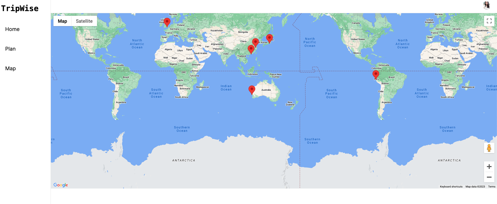
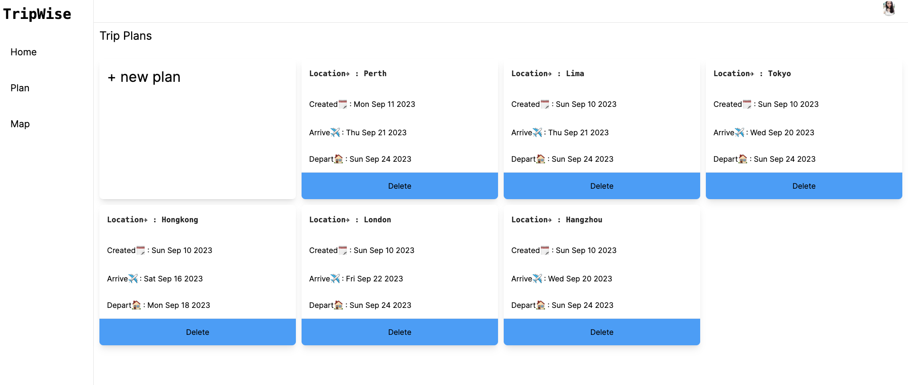
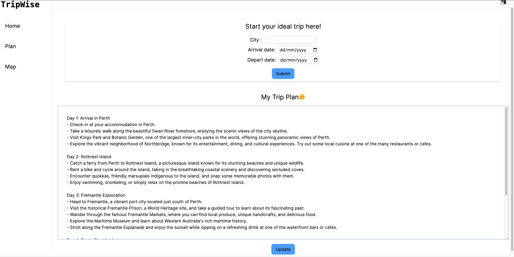

# tripWise

### **App features**

- Users will be able to log in with google account or create their own accounts;
- After logging in, if they are new users, they will jump to a new user page and redirect to trip plan page;
- Allow users to select their destination and date to interact with AI to generate a trip plan;
- Allow users to edit their destination/date/trip plan and save;
- Allow users to look in Google map with the Pins which locates all their plans' location;
- Allow users to delete/create a trip plan.

### **Technologies used**

- React Next.js 13 framework
- PostgreSQL, Prisma(ORM), OpenAI, Clerk
- HTML, TailwindCSS

### **Deployment link**

- Link: https://trip-wise-omega.vercel.app/
- Please allow few time for the app to generate a new plan for you to play around.

### **App screenshot**

--

